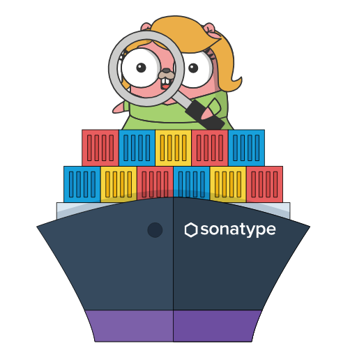
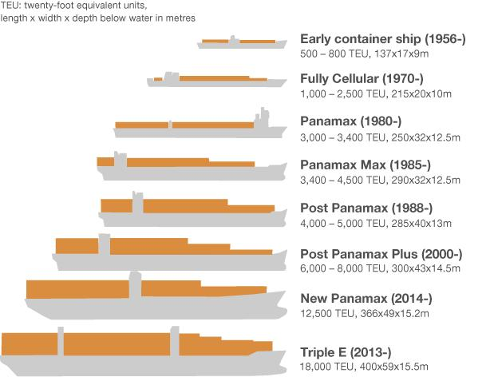

<p align="center">
    
</p>


# NEWSFLASH!  Nancy has a new ship!

The community team at Sonatype has been working hard on upgrading **docker-nancy** from a Post Panamax cargo ship to a new and improved Triple E vessel. (See the diagram below).  As a result, this project is being archived.

You can get a hold of a dockerized version of Nancy now at [nancy](https://github.com/sonatype-nexus-community/nancy) (https://github.com/sonatype-nexus-community/nancy)

Bon Voyage!


<p align="center">
    
</p>
Image courtesy of: [Vessel Tracking](http://www.vesseltracking.net/article/biggest-container-ship)


# docker-nancy

`docker-nancy`- it's like [nancy](https://github.com/sonatype-nexus-community/nancy)... **on a boat!** 

Nancy is a tool to check for vulnerabilities in your Golang dependencies, powered by [Sonatype OSS Index](https://ossindex.sonatype.org/) and ```docker-nancy``` wraps the `nancy` executable in a Docker image.

You can see an example of using `nancy` in Travis-CI at [this intentionally vulnerable repo we made](https://github.com/sonatype-nexus-community/intentionally-vulnerable-golang-project).


## Quickstart

The best way to get up and running is to clone this repository and build the image as follows and create an alias to execute against a running image:

``` shell
	 docker build -t sonatype-nexus-community/docker-nancy:latest .
	 alias nancy="docker run -it --rm -v $(pwd):/tmp --name nancy sonatype-nexus-community/docker-nancy:latest"
```


## Using docker-nancy

Once the image is built and the alias has been created, run  ```nancy``` in a directory containing a ```go.sum``` file as follows:

``` shell
nancy go.sum
```

There is a known limitation right now where the container will only process go.sum files that exist in the current directory. This is different than the implementation of the non-containerized ```nancy``` binary.

To view other commands and options simply run the nancy alias:

``` shell
$ nancy
Usage:
nancy [options] </path/to/Gopkg.lock>
nancy [options] </path/to/go.sum>

Options:
  -exclude-vulnerability value
    	Comma seperated list of CVEs to exclude
  -no-color
    	indicate output should not be colorized
  -noColor
    	indicate output should not be colorized (deprecated: please use no-color)
  -quiet
    	indicate output should contain only packages with vulnerabilities
  -version
    	prints current nancy version
```


## Contributing

We care a lot about making the world a safer place, and that's why we created `docker-nancy`. If you as well want to speed up the pace of software development by working on this project, jump on in! Before you start work, create a new issue, or comment on an existing issue, to let others know you are!


## Acknowledgements

The `nancy` logo was created using a combo of [Gopherize.me](https://gopherize.me/) and good ole Photoshop. Thanks to the creators of  Gopherize for an easy way to make a fun Gopher :)


Thank you to The Lonely Island for your late night [inspiration about boats](https://youtu.be/9iUjx4_X1qA)...


## The Fine Print

It is worth noting that this is **NOT SUPPORTED** by Sonatype, and is a contribution of ours to the open source community (read: you!)

Remember:

*  Use this contribution at the risk tolerance that you have
* Do NOT file Sonatype support tickets related to `docker-nancy` support in regard to this project
* DO file issues here on GitHub, so that the community can pitch in


## Getting help

Looking to contribute to our code but need some help? There's a few ways to get information:

* Chat with us on [Gitter](https://gitter.im/sonatype/nexus-developers)
* DM [@djschleen](https://twitter.com/djschleen)